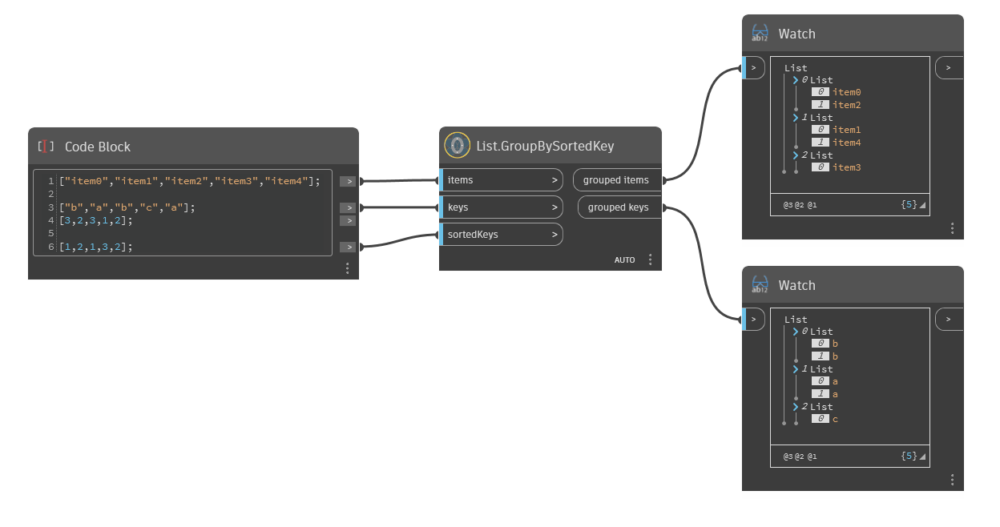

## In Depth  
Group items into sublists based on the list of sorted key values. This may be helpfuld if items and keys are from some elements and it must corresponde with some other sorted list with slightly other values, where the result must include both items and keys.  
  
**Example**  
  
**WebSite**  
[Github](https://github.com/erfajo/OrchidForDynamo) -- [Issues](https://github.com/erfajo/OrchidForDynamo/issues) -- [Samples](https://github.com/erfajo/OrchidForDynamo/tree/master/Samples) -- [Blog](https://erfajo.blogspot.com)
