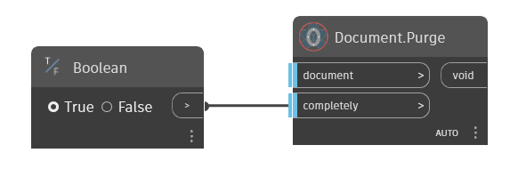

## In Depth  
Purge document.  
If input port "completely" is set to true, does purge include the functions from following nodes:  
- ViewTemplate.Purge
- ProjectParameter.Purge
- LineStyle.Purge
- LinePattern.Purge
- ParameterFilter.Purge
- Material.Purge
- Asset.Purge
  
Completely may take a while since it is evaluating many objects in the document!  
  
**Example**  

**WebSite**  
[Github](https://github.com/erfajo/OrchidForDynamo) -- [Issues](https://github.com/erfajo/OrchidForDynamo/issues) -- [Samples](https://github.com/erfajo/OrchidForDynamo/tree/master/Samples) -- [Blog](https://erfajo.blogspot.com)
