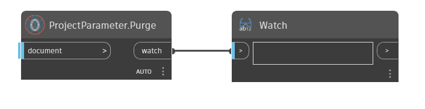

## In Depth  
Purges all project and shared parameter in document not in use!  

**Example**  

**WebSite**  
[Github](https://github.com/erfajo/OrchidForDynamo) -- [Issues](https://github.com/erfajo/OrchidForDynamo/issues) -- [Samples](https://github.com/erfajo/OrchidForDynamo/tree/master/Samples) -- [Blog](https://erfajo.blogspot.com)
