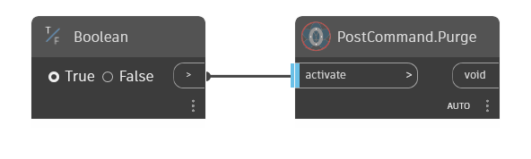

## In Depth  
Purge postcommand comparative to the Revit built-in purge function. This function will run until it is "terminated" by shifting the inport "activate" value to "false"!  
  
**Example**  

**WebSite**  
[Github](https://github.com/erfajo/OrchidForDynamo) -- [Issues](https://github.com/erfajo/OrchidForDynamo/issues) -- [Samples](https://github.com/erfajo/OrchidForDynamo/tree/master/Samples) -- [Blog](https://erfajo.blogspot.com)
