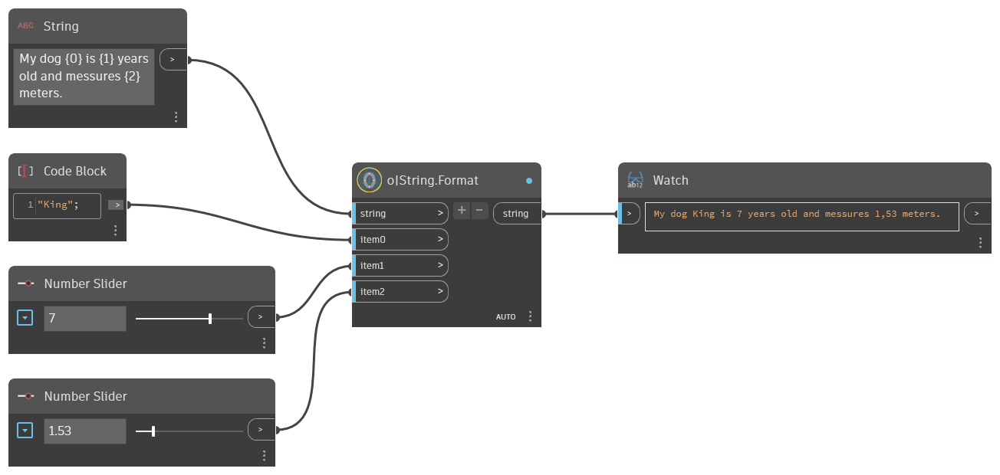

## In Depth  
String formater combines items send to the input ports by adding the port numeric value inside curly brackets.  
E.g. string = "Hello {0}!", item0 = "World", result = "Hello world!".  
  
More ports can be added by pushing the plus sign in the node or removing ports by pushing the minus sign in the node.  
  
**Example**  

**WebSite**  
[Github](https://github.com/erfajo/OrchidForDynamo) -- [Issues](https://github.com/erfajo/OrchidForDynamo/issues) -- [Samples](https://github.com/erfajo/OrchidForDynamo/tree/master/Samples) -- [Blog](https://erfajo.blogspot.com)
