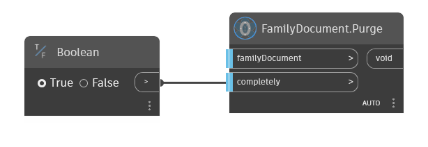

## In Depth  
Purge family document.  
If input port "completely" is set to true, does purge include the functions from following nodes:  
- LineStyle.Purge
- Category.DeleteImported
- Material.Purge
- Asset.Purge 
  
**Example**  

**WebSite**  
[Github](https://github.com/erfajo/OrchidForDynamo) -- [Issues](https://github.com/erfajo/OrchidForDynamo/issues) -- [Samples](https://github.com/erfajo/OrchidForDynamo/tree/master/Samples) -- [Blog](https://erfajo.blogspot.com)
